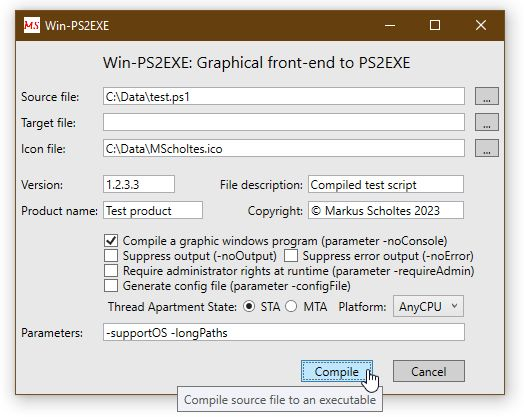

# Win-PS2EXE
Graphical front end to the module version of the PS1-to-EXE-compiler PS2EXE

Author: Markus Scholtes

Version: 1.0.1.2

Date: 2023-09-24

With [PS2EXE](https://gallery.technet.microsoft.com/PS2EXE-GUI-Convert-e7cb69d5) originally created by Ingo Karstein you can compile Powershell scripts to real Windows executables. **Win-PS2EXE** is a small graphical front end to the script.

### Features and restrictions:
* **Win-PS2EXE** does not support all parameters of **PS2EXE**
* WPF application that compiles without Visual Studio or MSBuild on every Windows with .Net 4.x
* only one source file
* drag'n'drop for file names

### Screenshot:

### How to compile:
Run **Compile.bat**.

### How to use:
Install module **PS2EXE**.

Start **Win-PS2EXE** by typing Win-PS2EXE in a powershell console and fill in the desired fields (only *Source file* is mandatory).

Click **Compile**, a powershell window opens and your powershell script will be compiled to an executable.

### Changes:
1.0.1.2: new text field for additional parameters

1.0.1.1: target folder dialog added (code by Josip Medved, https://www.medo64.com/2011/12/openfolderdialog/)

1.0.0.3: file fields no longer run out

1.0.0.2: -noConfigFile is default now
